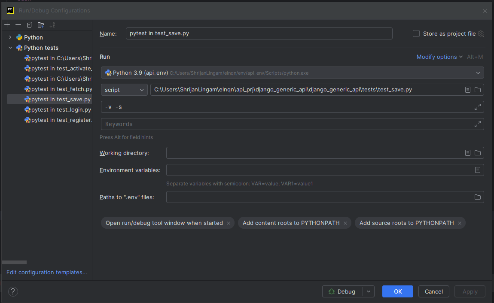

## To run test cases:

- Navigate to the directory containing the setup.py file for this package.
### To run all test cases:
```bash 
python setup.py pytest
```

### To run individual file:
```bash 
python setup.py pytest --addopts "<path_to_your_test_file>"

# example : python setup.py pytest --addopts "django_generic_api/tests/test_basic.py"
```

## Configuring Pytest for individual file.
- To configure pytest, follow these steps:

### In PyCharm:
- Run > Edit Configurations.
- Click on Add new configuration and select pytest.
- Select the path for your python virtual_environment/Scripts/python.exe.
- Select your test_case file below.
- Add additional arguments as required (-v, -s, ...).
- Now click on apply and OK.


## Running Tests

- To run a Test case file, follow these steps:

### In PyCharm:
- Create a pytest configuration for the file if it does not already exist.
- Use the debugger to run the test case file.
